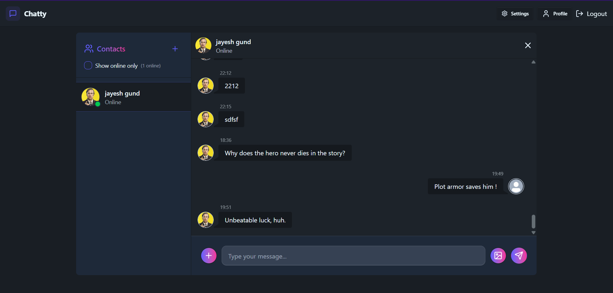

# Chat-App


Welcome to the Chat-App repository! This project is a real-time AI powered chat application built using modern web technologies. Below, you'll find a comprehensive guide to getting started with the project, including installation steps and how to run both the frontend and backend servers.

## Table of Contents

- [Prerequisites](#prerequisites)
- [Installation](#installation)
- [Running the Project](#running-the-project)
- [Project Structure](#project-structure)
- [Features](#features)
- [Screenshots](#screenshots)
- [Contributing](#contributing)
- [License](#license)

## Prerequisites

Before you begin, ensure you have met the following requirements:

- **Node.js**: Make sure you have Node.js installed on your machine. You can download it from [nodejs.org](https://nodejs.org/).

## Installation

Follow these steps to set up the project on your local machine:

1. **Clone the repository**:
    ```bash
    git clone https://github.com/Jayesh1808git/Chat-App.git
    cd Chat-App
    ```

2. **Install dependencies for the frontend and backend**:
    - Navigate to the frontend directory and install dependencies:
        ```bash
        cd Frontend
        npm install
        ```

    - Navigate to the backend directory and install dependencies:
        ```bash
        cd ../Backend
        npm install
        ```

## Running the Project

To run the project, you'll need to start both the frontend and backend servers. Follow these steps:

1. **Run the backend server**:
    - Open a terminal and navigate to the `Backend` directory:
        ```bash
        cd Backend
        ```
    - Start the backend server:
        ```bash
        npm run dev
        ```

2. **Run the frontend server**:
    - Open a new terminal and navigate to the `Frontend` directory:
        ```bash
        cd Frontend
        ```
    - Start the frontend server:
        ```bash
        npm run dev
        ```

Both servers should now be running, and you can access the chat application in your browser at `http://localhost:3000` (or the port specified for your frontend server).

## Project Structure

Here's a brief overview of the project structure:

```
Chat-App/
├── Backend/          # Backend server code
│   ├── node_modules/ # Backend dependencies
│   ├── src/          # Source code for the backend
│   ├── package.json  # Backend package configuration
│   └── ...           # Other backend files
├── Frontend/         # Frontend client code
│   ├── node_modules/ # Frontend dependencies
│   ├── src/          # Source code for the frontend
│   ├── public/       # Public assets
│   ├── package.json  # Frontend package configuration
│   └── ...           # Other frontend files
└── README.md         # Project README file
```

## Features

- Real-time messaging with WebSockets
- User authentication and authorization
- **Smart Replies**: Get AI-driven smart replies to quickly respond to messages.
- **Sentiment Analysis**: Analyze the sentiment of messages to understand the tone.
- **Message Scheduling**: Schedule messages to be sent at a later time.
- Image sharing

## Screenshots





## Contributing

We welcome contributions to improve the Chat-App! To contribute, please follow these steps:

1. Fork the repository.
2. Create a new branch (`git checkout -b feature/your-feature-name`).
3. Make your changes and commit them (`git commit -m 'Add some feature'`).
4. Push to the branch (`git push origin feature/your-feature-name`).
5. Create a pull request.

## License

This project is licensed under the MIT License. See the [LICENSE](LICENSE) file for more details.

---

Thank you for using Chat-App! If you have any questions or feedback, feel free to open an issue or contribute to the project.
